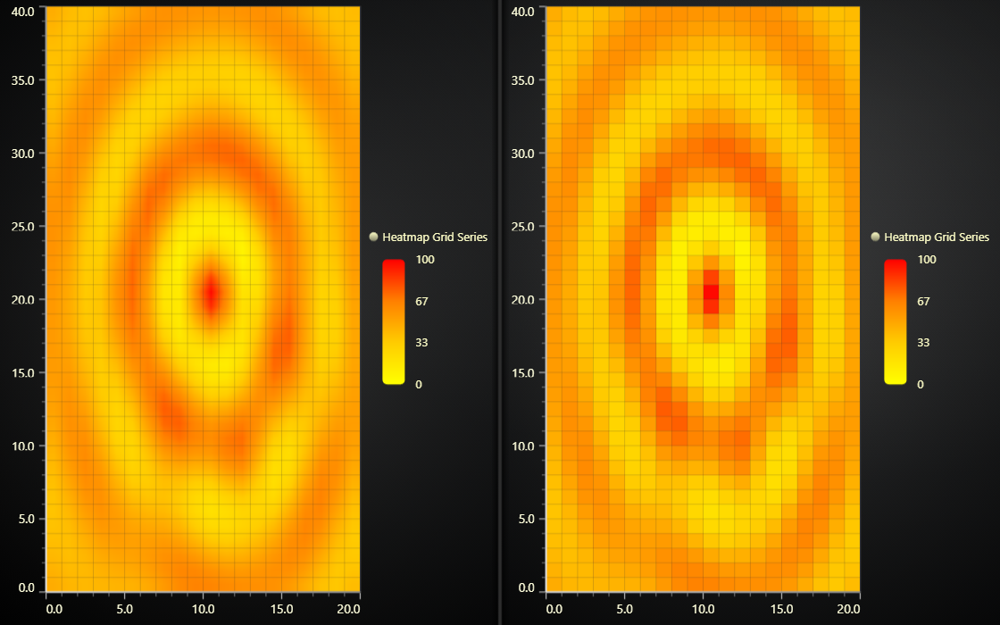

# JavaScript Heatmap Bilinear Interpolation Chart



This demo application belongs to the set of examples for LightningChart JS, data visualization library for JavaScript.

LightningChart JS is entirely GPU accelerated and performance optimized charting library for presenting massive amounts of data. It offers an easy way of creating sophisticated and interactive charts and adding them to your website or web application.

The demo can be used as an example or a seed project. Local execution requires the following steps:

-   Make sure that relevant version of [Node.js](https://nodejs.org/en/download/) is installed
-   Open the project folder in a terminal:

          npm install              # fetches dependencies
          npm start                # builds an application and starts the development server

-   The application is available at _http://localhost:8080_ in your browser, webpack-dev-server provides hot reload functionality.


## Description

This example showcases the _pixel interpolation mode_ feature of `HeatmapGridSeries`.

`HeatmapGridSeries` comes with powerful _per-pixel bilinear interpolation_ which smooths the data visualization by automatically interpolating intensity values and adjusting dynamic coloring accordingly.
_Bilinear interpolation_ is a standard, well-known method in _data analysis_ - and it also looks cool!

This example shows _two_ `HeatmapGridSeries` side by side with the same data, the series on left has bilinear interpolation enabled (default) and on right it is disabled.

As can be seen, the _heatmap_ with bilinear interpolation looks much more detailed and convincing.
However, it can be useful to disable this if you need to always be sure that what you're seeing is the exact data you supplied - not some interpolated value.

```js
// Example syntax for specifying heatmap pixel interpolation mode.

heatmapSeries.setIntensityInterpolation('disabled')

heatmapSeries.setIntensityInterpolation('bilinear')
```

_Pixel interpolation mode has no significant effect on performance._

The Heatmap on the left also showcases _auto cursor interpolation_, which can be enabled per-heatmap series with `setCursorInterpolationEnabled(true)`.


## API Links

* [Heatmap Grid Series]
* [Paletted Fill Style]
* [Color lookup table]
* [Empty line style]
* [Chart XY]
* [Axis XY]
* [Legend Box]


## Support

If you notice an error in the example code, please open an issue on [GitHub][0] repository of the entire example.

Official [API documentation][1] can be found on [LightningChart][2] website.

If the docs and other materials do not solve your problem as well as implementation help is needed, ask on [StackOverflow][3] (tagged lightningchart).

If you think you found a bug in the LightningChart JavaScript library, please contact sales@lightningchart.com.

Direct developer email support can be purchased through a [Support Plan][4] or by contacting sales@lightningchart.com.

[0]: https://github.com/Arction/
[1]: https://lightningchart.com/lightningchart-js-api-documentation/
[2]: https://lightningchart.com
[3]: https://stackoverflow.com/questions/tagged/lightningchart
[4]: https://lightningchart.com/support-services/

© LightningChart Ltd 2009-2022. All rights reserved.


[Heatmap Grid Series]: https://lightningchart.com/js-charts/api-documentation/v7.0.1/classes/HeatmapGridSeriesIntensityValues.html
[Paletted Fill Style]: https://lightningchart.com/js-charts/api-documentation/v7.0.1/classes/PalettedFill.html
[Color lookup table]: https://lightningchart.com/js-charts/api-documentation/v7.0.1/classes/LUT.html
[Empty line style]: https://lightningchart.com/js-charts/api-documentation/v7.0.1/variables/emptyLine.html
[Chart XY]: https://lightningchart.com/js-charts/api-documentation/v7.0.1/classes/ChartXY.html
[Axis XY]: https://lightningchart.com/js-charts/api-documentation/v7.0.1/classes/Axis.html
[Legend Box]: https://lightningchart.com/js-charts/api-documentation/v7.0.1/classes/Chart.html#addLegendBox

